# Installation driver ODBC sous Windows

## Introduction

Lors de l'installation du driver `ODBC` sous `Windows`, hormis le fait de devoir choisir entre la version 32 bits ou la version 64 bits, nous avons la possibilitée
de choisir entre la version original et la version [mimalloc](https://github.com/microsoft/mimalloc "mimalloc is a compact general purpose allocator with excellent performance")

::: tip Explications
La différence principale entre le driver ODBC original de PostgreSQL et celui utilisant l'allocateur mimalloc réside dans la gestion de la mémoire, surtout dans les environnements multi-threadés :

* Le driver original utilise l'allocateur mémoire par défaut du système (généralement malloc/free), ce qui peut entraîner des problèmes de contention de verrous (lock contention) lors d'allocation mémoire simultanée par plusieurs threads. Cela peut ralentir les applications multi-threadées, notamment sur Windows, en raison de la synchronisation nécessaire pour gérer les allocations mémoire.

* Le driver utilisant mimalloc remplace l'allocateur par défaut par mimalloc, un allocateur mémoire moderne conçu pour réduire la contention de verrous et améliorer les performances, surtout dans les applications multi-threadées. Les tests montrent que cela élimine les délais liés à la contention mémoire, sans impact sur la stabilité, et est utilisé en [production](https://postgrespro.com/list/thread-id/2689876 "performance and reduce memory allocation lock contention") depuis plusieurs mois sans problème.

En résumé, la version avec [mimalloc](https://github.com/postgresql-interfaces/psqlodbc/pull/6 "Use mimalloc to improve performance and reduce memory allocation lock contention") offre une meilleure performance et une réduction de la contention mémoire, 
ce qui est particulièrement utile pour les applications multi-threadées. 

L'utilisation de mimalloc est optionnelle et doit être activée lors de la compilation du driver.
:::

## Installation

La première étape consite à télécharger le driver `ODBC`.

### Téléchargement

Pour télécharger l'installeur, rendez vous sur [la page de téléchargement(https://www.postgresql.org/ftp/odbc/releases/ "Téléchargement driver Windows")] du driver `ODBC` pour windows, cliquer sur la denrière version contenant **mimalloc** dans le nom de dossier, puis sélectionner la version 64 bits au format **MSI**

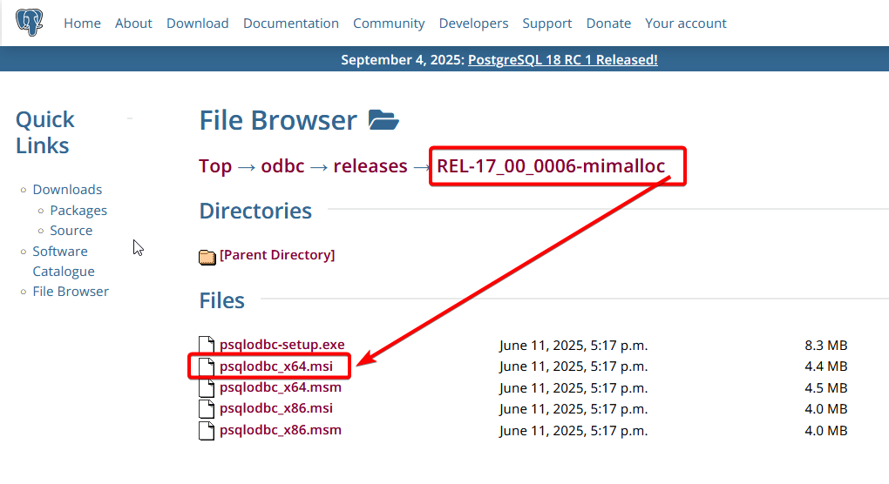

Lorsque le téélchargement est terminé, rendez vous dans votre dossier téléchargement

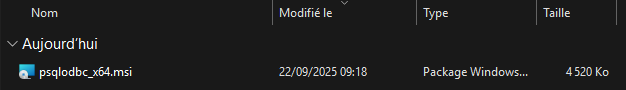

Ensuite fait eun clic droit, puis executer en tant qu'administrateur (les droits administrateur sont nécessaires pour installer les pilote ODBC).

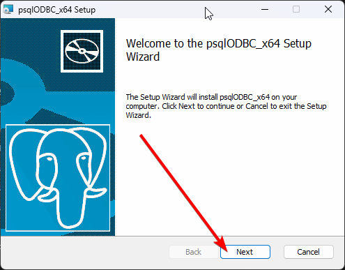

Dans cet écran cliquer seulement sur `Next`

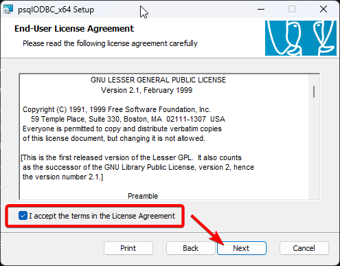

Sur l'écran de licence, cocher la case pour l'accepter, puis cliquer sur `Next`

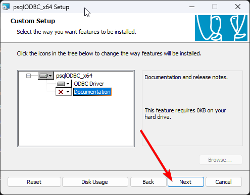

Cet écran permet de choisir si l'on souhaite installer la documentation (en Anglais) en plus des **Drivers ODBC**, valider avec `Next`

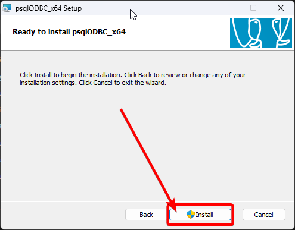

A partir de cet écran, nosu somme prêt a installer les drivers, il faut les droits administrateur pour pouvoir continuer. cliquer sur `Install`

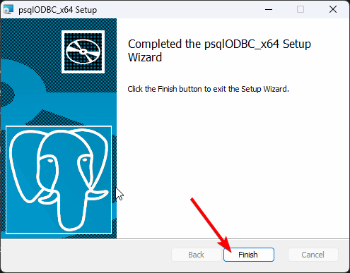

L'installation est terminée, cliquer sur `Finish`.

## Vérification

Pour vérifier que les drivers `ODBC` de PostgreSQL sont bien installés, rendez vous dans `Source de données ODBC 64 bits` (ou `Source de données ODBC 32 bits` si vous avez installé une version 32 bits), a partir du menu Windows, rechercher **odbc 64** puis cliquer sur ouvrir.

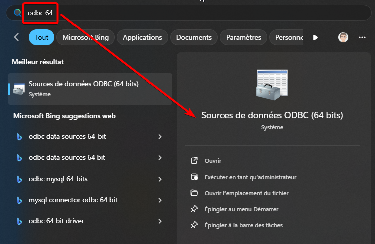

L'outil `Administrateur de souce de données ODBC (64 bits)` s'ouvre, ensuite rendez vous dans l'onglet **Pilotes ODBC**.

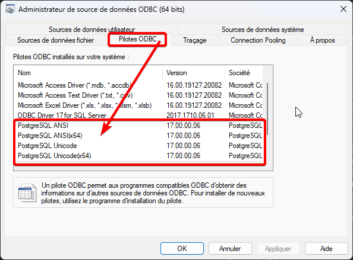

Dnas le tableau, vous devez voir apparaîtres les drivers ODBC AINSI et Unicode, si vous le svoyez , votre installation est terminée.

## Source de données utilisateur

Une source de données utilisateur n'est visible que par l'utilisateur connecté (session ouverte actuelle), elle ne sera donc pas visible des autres utilisateurs de la station de travail.

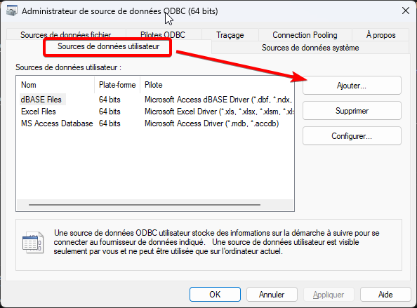

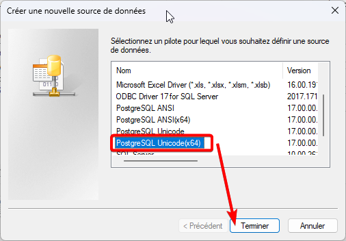

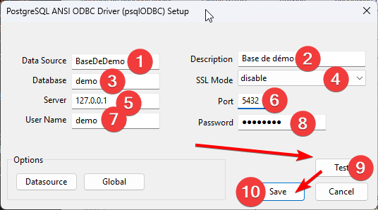

1. Nom de la source de données, sera utilisé lros des appels à cette source.
2. Libellé de cette source de données
3. Nom de la base de données PostgreSQL
4. Sélectionné le mode SSL, par défaut c'est désactivé.
5. Le nom ou l'adresse IP du serveur PostgreSQL
6. Port du serveur PostgreSQL, (par défaut 5432)
7. Nom de l'utilisateur POstgreSQL
8. Mot de passe de l'utilisateur 
9. Bouton pour tester la connexion
10. Sauvegarde de cette configuration

Lors de l'appuis sur le bouton test, vous devez obtenir le message suivant

Notre source utilisateur apparaît dans notre liste à présent.

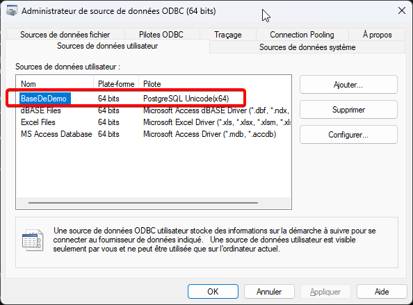

## Source de données système

Une source de données système, contrairement à une source de données utilisateur, est visible par tous les utilisateurs de la station de travail.

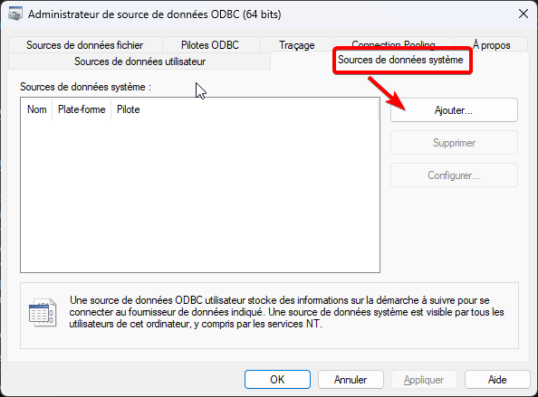

1. Nom de la source de données, sera utilisé lros des appels à cette source.
2. Libellé de cette source de données
3. Nom de la base de données PostgreSQL
4. Sélectionné le mode SSL, par défaut c'est désactivé.
5. Le nom ou l'adresse IP du serveur PostgreSQL
6. Port du serveur PostgreSQL, (par défaut 5432)
7. Nom de l'utilisateur POstgreSQL
8. Mot de passe de l'utilisateur 
9. Bouton pour tester la connexion
10. Sauvegarde de cette configuration

Lors de l'appuis sur le bouton test, vous devez obtenir le message suivant

Notre source utilisateur apparaît dans notre liste à présent.

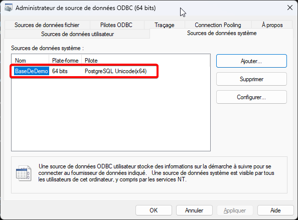
