# Installation PostgreSQL 17 sous Windows

## Etapes d'installation

Après avoir téléchargé l'installeur, vous devez avoir un fichier similaire dans votre dossier **Téléchargements**

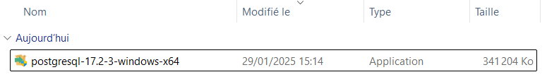

::: warning
Les droits administrateur seront requis pour l'installation de PostgreSQL en tant que service Windows
:::

Selectionner votre installeur puis faite un clic droit

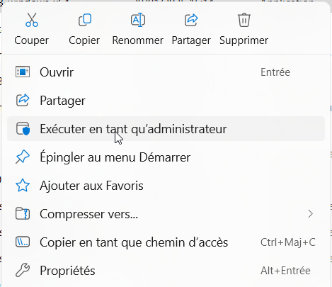

Puis sélectionner **Exécuter en tant qu'administrateur**

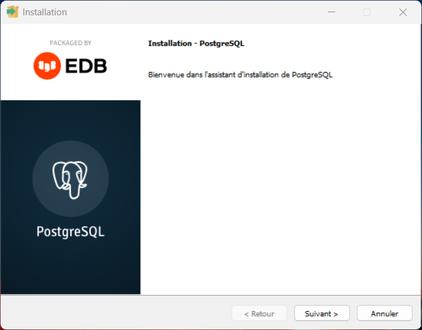

Nous arrivons sur l'écran de bienvenue, rien à faire de particulier, cliquer sur **Suivant**

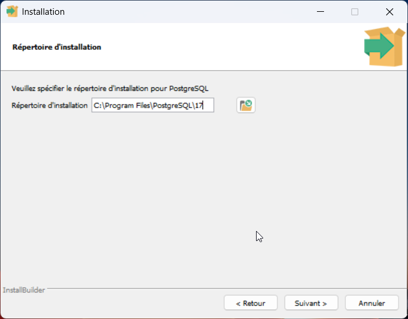

Cet écran nous propose de sélectionner le dossier d'installation, vous pouvez laisser le dossier par défaut, 
ou bien le changer pour utiliser un autre lecteur (D:, E:).

L'utilisation d'un autre lecteur que le C permet :

* Séparer la partition système de la partition des données, au cas ou vous auirez besoin de restaurer la partition système,
* Si votre lecteur C est de petite taille,
* Si vos lecteurs sont sur des disques distincts, pour améliorer les performances de lecture/écriture.

Puis valider sur **Suivant**

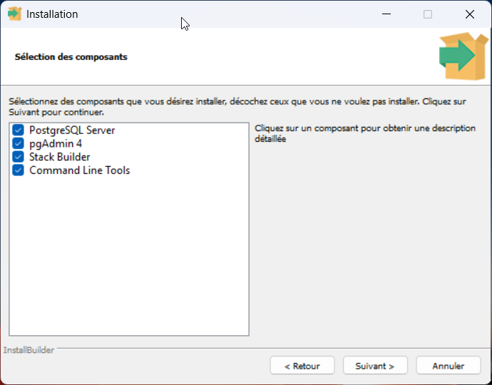

Ensuite nous allons sélectionner les composants a installer.

* **PostgreSQL Server**: Le sevreur PostgreSQL lui même
* **PgAdmin 4**: le client graphique permettant la gestion de la base de données PostgreSQL
* **Stack Builder**: Programme et extension suppélmentaire pour PostgreSQL
* **Command Line Tools**: Utilitaire PostgreSQL en ligne de commande (utilitaire psql par exemple)

Décocher les composants que vous ne souhaitez pas installer, puis cliquer sur **Suivant**

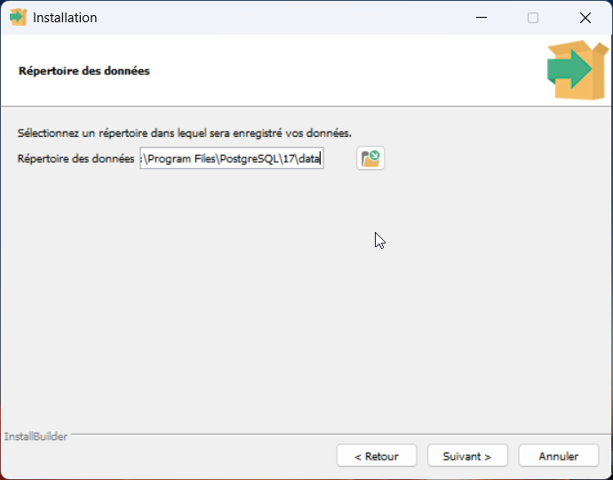

Sélectionner un dossier ou seront conservés les données des base de données créées.

Vous pouvez laisser le dossier par défaut, ou choisir un emplacement sur une autre lecteur.

::: warning
N'utiliser pas de lecteurs réseaux pour des questions de performances et de stabilité.
:::

Valider ensuite en cliquant sur **Suivant**

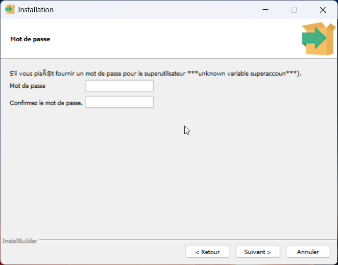

Vous devez définir ensuite le mot de passe de l'utilisateur **postgres**, cet utilisteur est le super utilisateur de la
base de données, mais également l'utilisateur windows qui lancera des service additionnel comme pgAgent par exemple.

Choisissez un mot de passe robuste pour cette utilisateur.

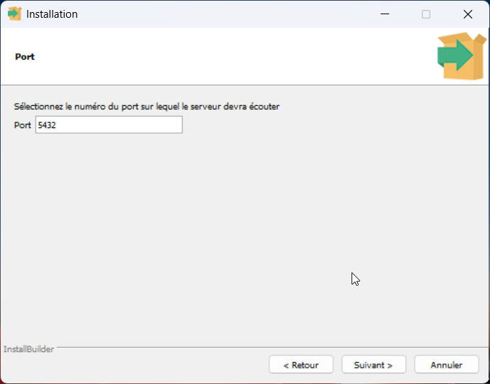

Le port par défaut de PostgreSQL est 5432, vous pouvez bien sur le changer

::: info
Sous Windows vous pouvez installer plusieurs versions de PostgreSQL, dans ce cas, il faudra un port différent
pour chacun des services 
:::

Valider en cliquant sur **Suivant**

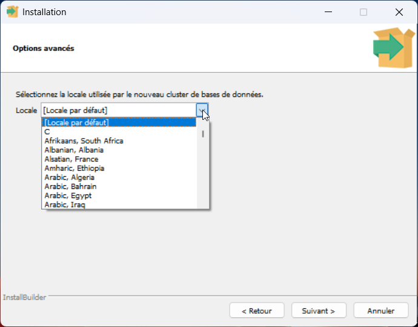

Vous pouvez sélectionner la locale par défaut de votre cluster

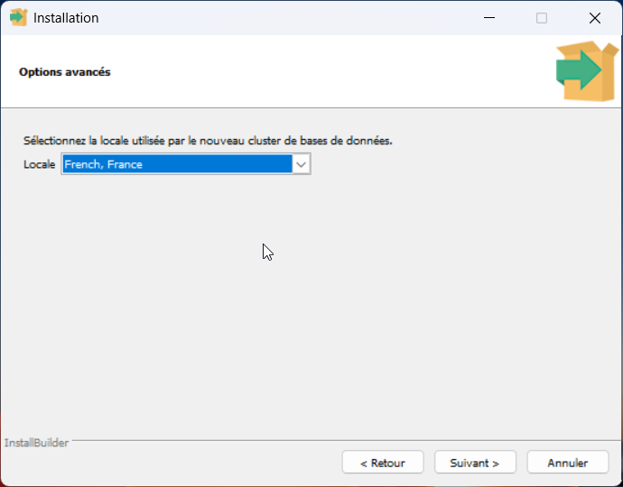

Si votre base de données contiendra des données exclusivement en français, je vous conseille de sélectionner **French, France** (ou tout autre variante de French)

Sinon je vous invite a lire la documentation à ce sujet.

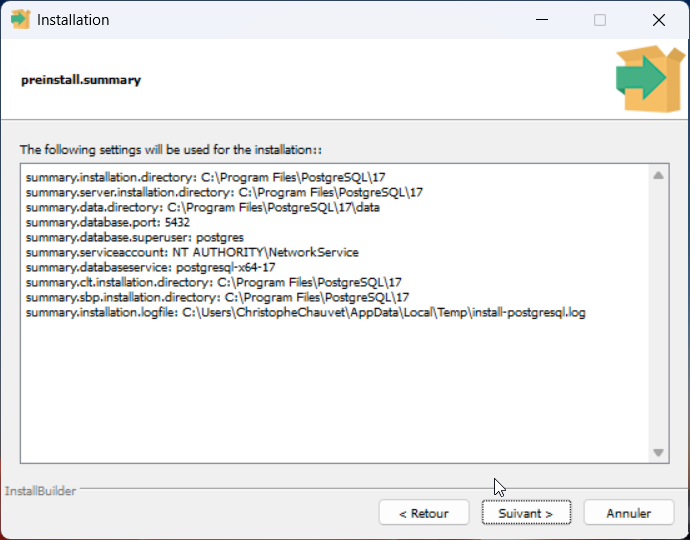

Cliquer sur **Suivant** pour débuter l'installation, ou **Retour** si vous souhaitez changer certaines options.

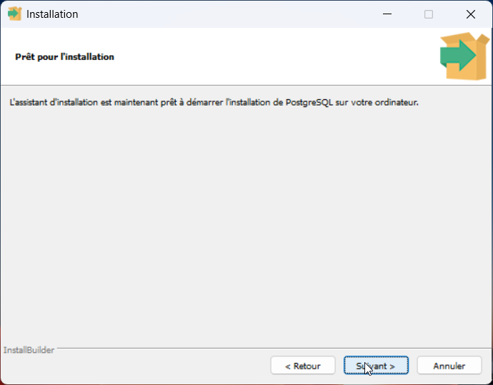

Confimer le lancement de l'installation en cliquant sur **Suivant**

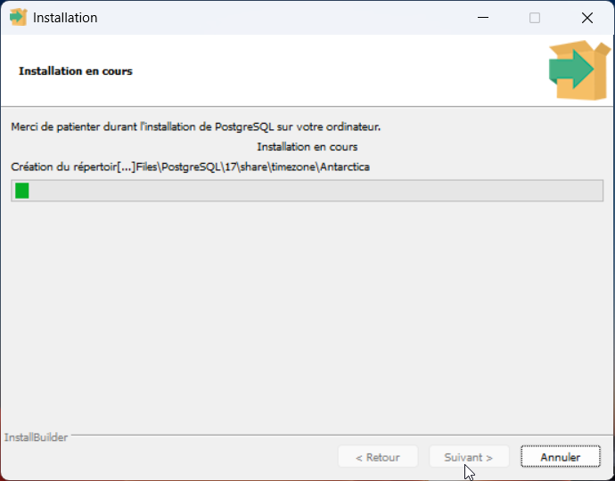

Cet écran vous affiche la progression de l'installation.

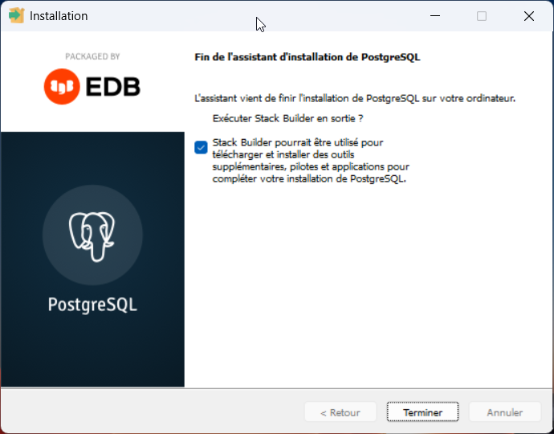

Ecran final d'installation.

Celui-ci vous demande si vous souhaitez lancer Stack Builder pour installer des composants additionnels.

Vous pourrez lancer le Stack Builder depuis le menu Windows ultérieurement.
