# Installation PostgreSQL 18 sous Windows

## Compatibilité

Ci dessous le tableau de compatibilité des versions de PostgreSQL et Windows (Server et Desktop)

| Version PostgreSQL | Version Windows  |
|:-:|:- |
| PostgreSQL 18 |  Windows Server 2025 64 bits<br />Windows Server 2022 64 bits<br />Windows Server 2019 64 bits<br /> Windows 11 64 Bits<br />Windows 10 64 Bits|
| PostgreSQL 17 |  Windows Server 2025 64 bits<br />Windows Server 2022 64 bits<br />Windows Server 2019 64 bits<br /> Windows 11 64 Bits<br />Windows 10 64 Bits|
| PostgreSQL 16 |  Windows Server 2022 64 bits<br />Windows Server 2019 64 bits<br />Windows 11 64 Bits<br />Windows 10 64 Bits|
| PostgreSQL 15 |  Windows Server 2019 64 bits<br />Windows Server 2016 64 bits<br />Windows 10 64 Bits|
| PostgreSQL 14 |  Windows Server 2019 64 bits<br />Windows Server 2016 64 bits<br />Windows 10 64 Bits|
| PostgreSQL 13 |  Windows Server 2019 64 bits<br />Windows Server 2016 64 bits<br />Windows 10 64 Bits|

::: info Cycle de vie 
Le cycle de vie des versions de PostgreSQL est défini dans la partie [information](../information.md#cycle-de-vie "Cycle de vie PostgreSQL")
:::

Installation des version précédentes

* [PostgreSQL version 17 sous Windows](./pg-17-windows.md "PostgreSQL version 17 sous Windows")

## Téléchargement

Après avoir téléchargé l'installeur, vous devez avoir un fichier similaire dans votre dossier **Téléchargements**

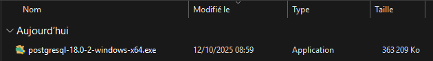

::: warning
Les droits administrateur seront requis pour l'installation de PostgreSQL en tant que service Windows
:::

## Exécution en mode administrateur

Selectionner votre ficher de l'installeur puis faite un clic droit

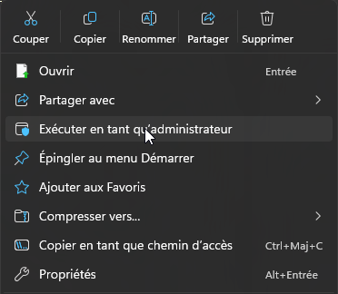

Puis sélectionner **Exécuter en tant qu'administrateur**

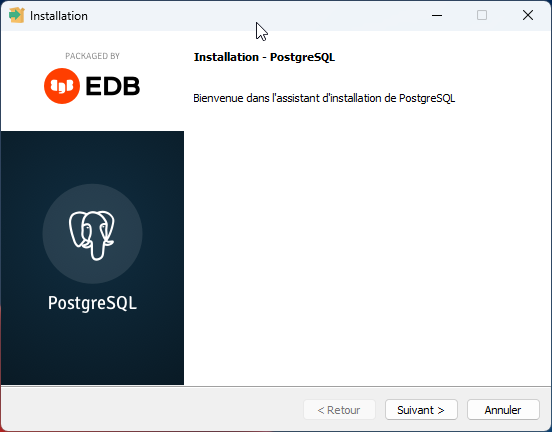

Nous arrivons sur l'écran de bienvenue, rien à faire de particulier, cliquer sur **Suivant**

## Dossier d'installation

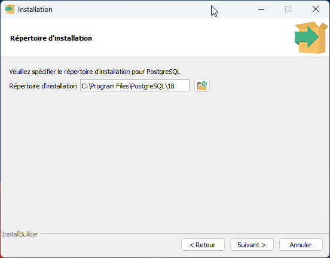

Cet écran nous propose de sélectionner le dossier d'installation, vous pouvez laisser le dossier par défaut, 
ou bien le changer pour utiliser un autre lecteur (D:, E:).

L'utilisation d'un autre lecteur que le C permet :

* Séparer la partition système de la partition des données, au cas ou vous auirez besoin de restaurer la partition système,
* Si votre lecteur C est de petite taille,
* Si vos lecteurs sont sur des disques distincts, pour améliorer les performances de lecture/écriture.

Puis valider sur **Suivant**

## Sélection des composants

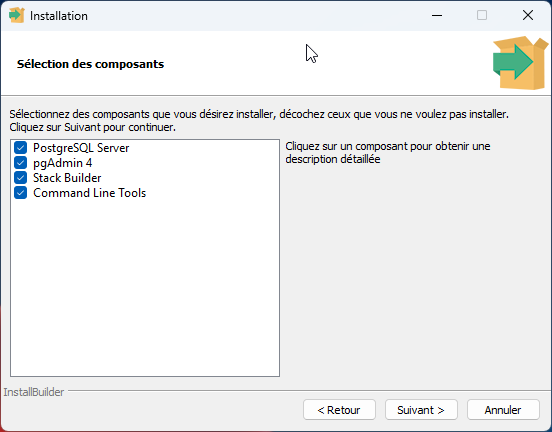

Ensuite nous allons sélectionner les composants a installer.

* **PostgreSQL Server**: Le serveur PostgreSQL lui même
* **PgAdmin 4**: le client graphique permettant la gestion de la base de données PostgreSQL
* **Stack Builder**: Programmes et extensions suppélmentaires pour PostgreSQL
* **Command Line Tools**: Utilitaire PostgreSQL en ligne de commande (utilitaire psql par exemple)

Décocher les composants que vous ne souhaitez pas installer, puis cliquer sur **Suivant**

## Dossier de données

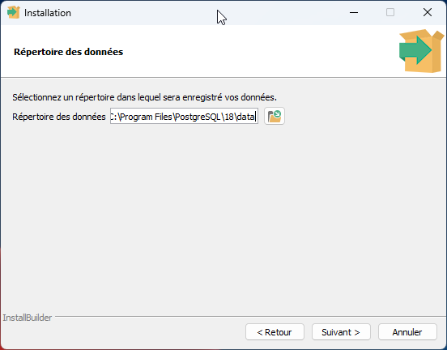

Sélectionner un dossier ou seront conservés les données des base de données créées.

Vous pouvez laisser le dossier par défaut, ou choisir un emplacement sur une autre lecteur.

::: warning
N'utiliser pas de lecteurs réseaux pour des questions de performance et de stabilité.
:::

Valider ensuite en cliquant sur **Suivant**

## Mot de passe

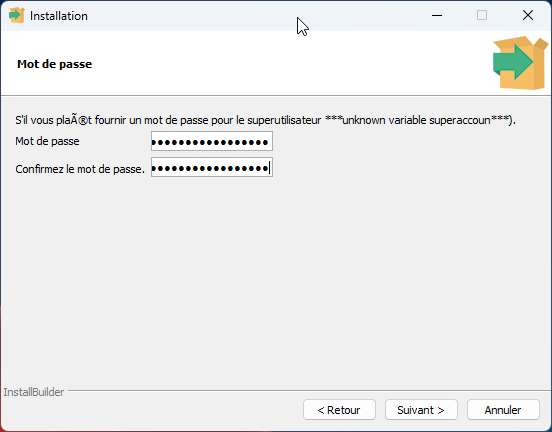

Vous devez définir ensuite le mot de passe de l'utilisateur **postgres**, cet utilisteur est le super utilisateur de la
base de données, mais également l'utilisateur windows qui lancera des service additionnel comme pgAgent par exemple.

Choisissez un mot de passe robuste pour cette utilisateur.

## Port d'écoute


Le port par défaut de PostgreSQL est 5432, vous pouvez bien sur le changer

::: info
Sous Windows vous pouvez installer plusieurs versions de PostgreSQL, dans ce cas, il faudra un port différent
pour chacun des services 
:::

Valider en cliquant sur **Suivant**

## Locale

Vous pouvez sélectionner la locale par défaut de votre cluster

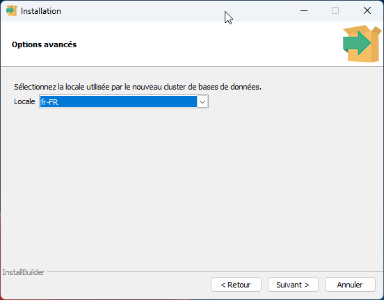

Si votre base de données contiendra des données exclusivement en français, je vous conseille de sélectionner **French, France** (ou tout autre variante de French)

Sinon je vous invite à lire la documentation à ce sujet.

## Résumé

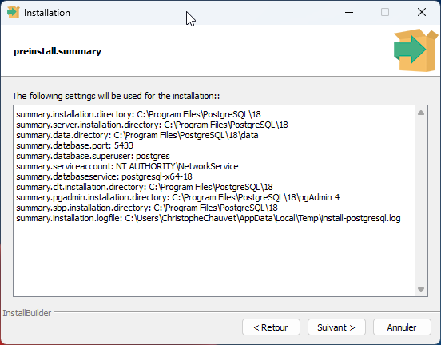

Cliquer sur **Suivant** pour débuter l'installation, ou **Retour** si vous souhaitez changer certaines options.

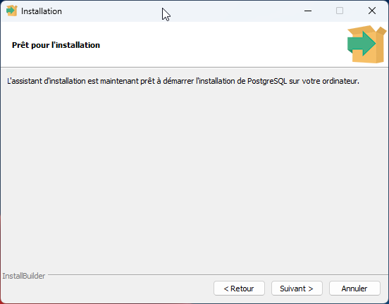

Confimer le lancement de l'installation en cliquant sur **Suivant**

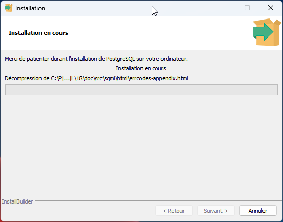

Cet écran vous affiche la progression de l'installation.

## Fin d'installation

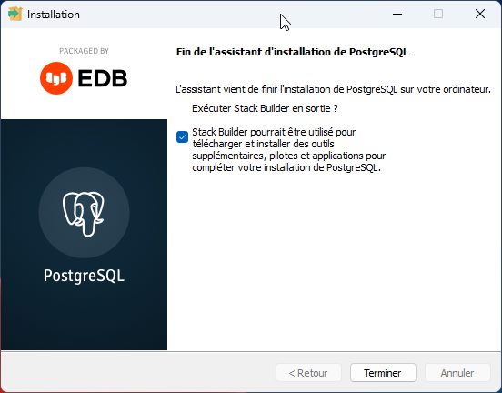

Ecran final d'installation.

Celui-ci vous demande si vous souhaitez lancer Stack Builder pour installer des composants additionnels.

Vous pourrez lancer le Stack Builder depuis le menu Windows ultérieurement.

## Sécurisation

Même si on est sous Windows, la sécurité à son importance. Il convient donc d'ajouter une règle entrante
pour autoriser le port 5432 (ou celui que vous avez mis) en TCP

::: warning
Le parefeu de Windows Server 2025 bloque les connexions par défaut, il faut par conséquent ouvrir le port 
que vous avez définit pendant l'installation de PostgreSQL

Et comme on est pas à l'abri qu'une MAJ Windows force la fermeture des ports par défaut si aucune règle n'est définie
il vaut mieux explicitement ajouter une règle dans le pare feu.
:::

Rendez vous dans le parefeu Windows, sélectonner `Règles de traffic entrant`, puis clic droit et `Nouvelle règle`

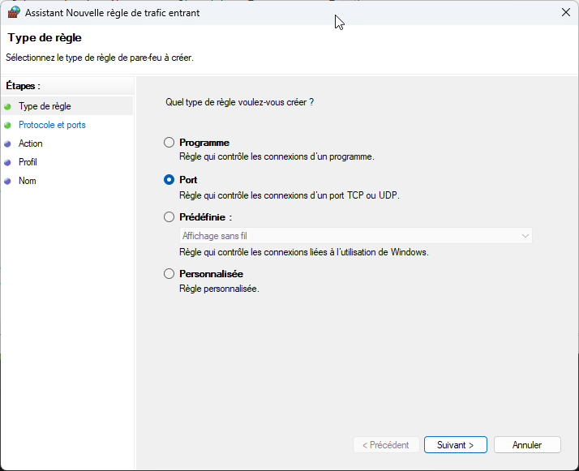

Selection le type de règle en sélectionnant `Port`, puis faite **suivant**

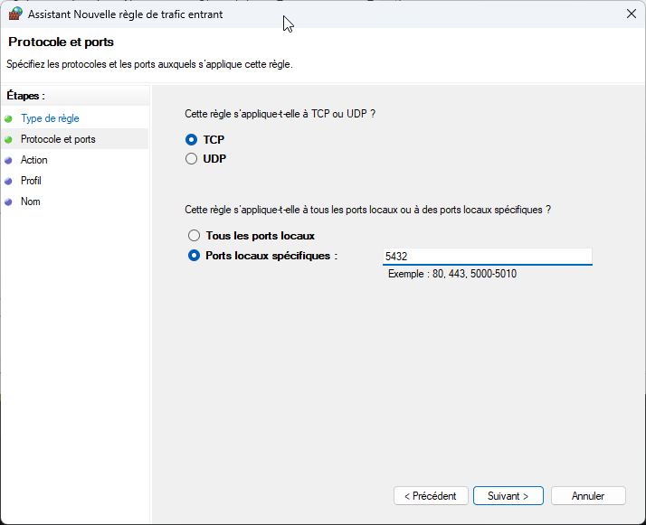

Sélectionner `TCP` puis `Ports locaux spécifiques` en indiquant `5432`.

::: tip Astuces
Si vous voulez indiquer plusieurs port, car vous avez plusieurs versions de PostgreSQL,
Vous séparez les différents ports par une virgule.
:::

Puis cliquer sur **Suivant**

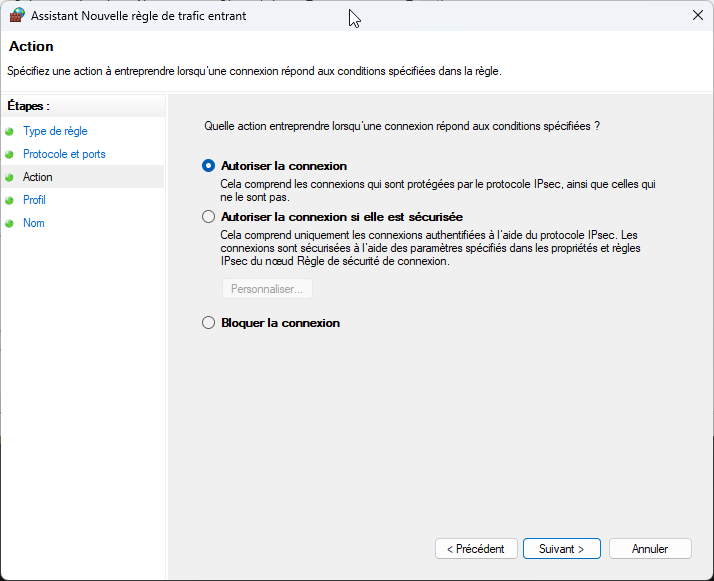

Sélectionner `Autoriser la connexion`, puis faite **Suivant**

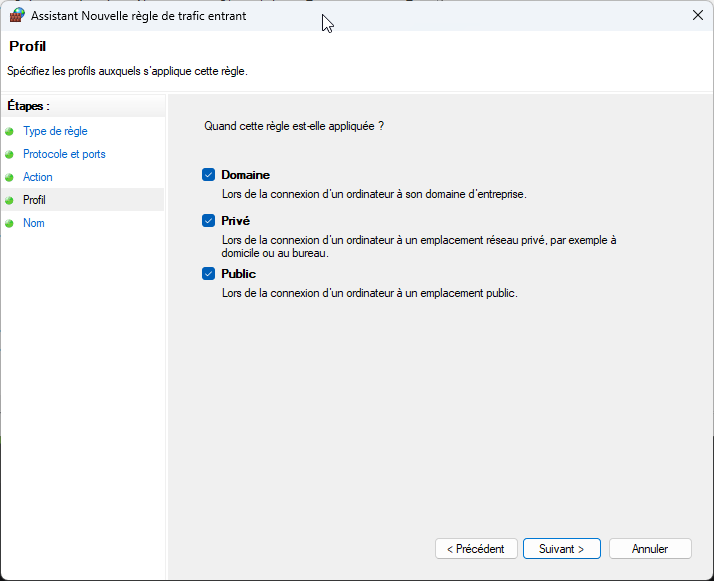

Selectionner les profils.

::: warning Avertissement
Si vous cocher `Public`, celui veux dire que vous autorisez l'éventuelle connexion 
depuis des hotspots ou connexion grand public (Gares, Hotels, Bars, Restaurants, etc.).

Ce mode n'est pas recommandé par défaut.
:::

Puis faite **Suivant**

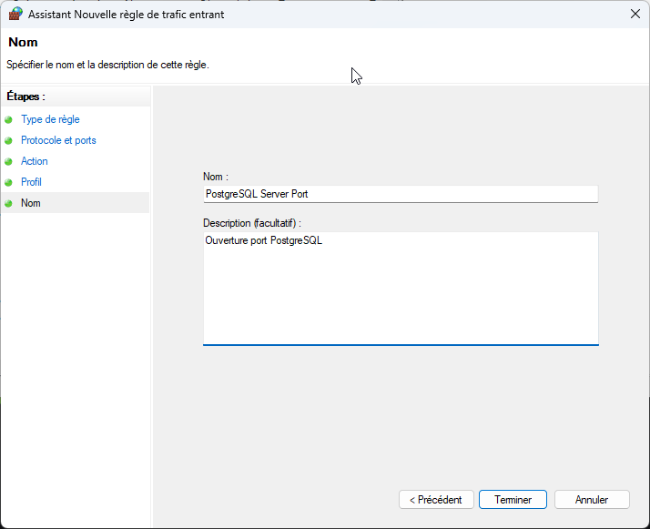

Dernière étapes, on nomme explicitement la règle poru la retoruver plus facilement dans la liste

Puis faite **Terminer**

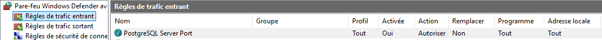

Vous pouvez également ajouter cette règle via Powershell, si vous souhaitez automatiser cette étape via la commande [New-NetFirewallRule](https://learn.microsoft.com/fr-fr/powershell/module/netsecurity/new-netfirewallrule "Commande Powershell New-NetFirewallRule")

```powershell
New-NetFirewallRule -Name "PostgreSQL Server Port" -DisplayName "PostgreSQL Server Port" -Description 'Ouverture port PostgreSQL' `
    -Profile Any -Direction Inbound -Action Allow -Protocol TCP -Program Any -LocalAddress Any -LocalPort 5432
```
