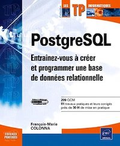

.. _livres:

Livres
======

.. title:: Livres sur PostgreSQL

.. meta::
   :description: Selection de livres en français autour de POstgreSQL
   :keywords: book, epub, livres, postgresql

.. index:: livres

Sélection de livres en français s'articulant autour de PostgreSQL

PostgreSQL - Architecture et notions avancées
---------------------------------------------

5 ème édition de ce livre écrit par:

* Guillaume Lelarge
* Julien Rouhaud

Lien vers `PostgreSQL - Architecture et notions avancées (5e édition) <https://www.d-booker.fr/bases-de-donnees/805-postgresql-architecture-et-notions-avancees-5ed.html>`_

* EAN: 9782822711241
* ISBN: 978-2-8227-1124-1 

Présentation
^^^^^^^^^^^^

.. image:: postgresql-architecture-et-notions-avancees-5ed.png
    :align: right

Pour maîtriser PostgreSQL, rien de mieux que de comprendre son fonctionnement interne.
C'est ce que vous proposent **Guillaume Lelarge**, consultant chez Dalibo, contributeur majeur de PostgreSQL,
ainsi que **Julien Rouhaud**, auteur notamment `d'HypoPg <https://hypopg.readthedocs.io>`_, avec ce livre sans équivalent, pas même en anglais.

Dans un style clair et précis, il vous explique en détails la mécanique de ce puissant système de gestion de bases de données open-source, vous aidant ainsi à en comprendre toutes les subtilités et donc à mieux l'administrer, le paramétrer, le superviser… en un mot à mieux l'utiliser.

Sa lecture ne requiert pas de connaissances avancées en PostgreSQL, ni la maîtrise préalable d'un autre moteur de bases de données. En revanche, il est préférable que vous soyez à l'aise avec le fonctionnement d'un système d'exploitation comme Linux. Une connaissance modérée du langage SQL sera un plus.

Cette cinquième édition, entièrement revue et complétée, prend en compte les nouveautés des versions 15 et 16 (septembre 2023).  Lorsque des différences importantes dues aux versions sont à noter, elles sont indiquées aussi clairement que possible.

Sommaire
^^^^^^^^

1. Instance
2. Fichiers
3. Contenu physique des fichiers
4. Architecture des processus
5. Architecture mémoire
6. Protocole de communication
7. Gestion des connexions
8. Gestion des transactions
9. Gestion des objets
10. Planification des requêtes
11. Sauvegarde et restauration
12. Réplication
13. Statistiques d'activité
14. Collecte et traitement des traces
15. Maintenance
16. Sécurité

PostgreSQL - Administration et exploitation de vos bases de données
-------------------------------------------------------------------

4 ème édition de ce livre écrit par:

* Sébastien Lardière

Lien vers `PostgreSQL - Administration et exploitation de vos bases de données <https://www.eyrolles.com/Informatique/Livre/postgresql-9782409011467/>`_

* EAN: 9782409011467
* ISBN:	978-2-409-01146-7

Présentation
^^^^^^^^^^^^

L'administrateur de bases de données, le technicien d'exploitation et le développeur trouveront dans ce livre 
les informations indispensables pour exploiter au mieux toutes les possibilités de PostgreSQL 
(en version 10 au moment de la rédaction).

Les premiers chapitres du livre couvrent l'installation de PostgreSQL sur Windows et GNU/Linux ainsi que la préparation de l'environnement d'exécution du serveur. L'auteur présente ensuite les applications clientes pouvant être utilisées, les différents paramètres de sécurité et les différents aspects de PostgreSQL concernant le support du langage SQL. Les chapitres qui suivent introduisent la programmation dans PostgreSQL et détaillent l'administration et l'exploitation (de la configuration du serveur aux différentes tâches d'exploitation, en passant par les sauvegardes). Un chapitre présente des outils annexes enrichissant l'utilisation de PostgreSQL. Enfin, l'auteur introduit le thème de la réplication des données entre différents serveurs, en étudiant la réplication physique et logique intégrée à PostgreSQL ainsi que l'outil Slony.

Sommaire
^^^^^^^^

1. Installation
2. Initialisation du système de fichiers
3. Connexions
4. Définition des données
5. Programmation
6. Exploitation
7. Outils
8. Réplication

PostgreSQL - Entraînez-vous à créer et programmer une base de données relationnelle
-----------------------------------------------------------------------------------

Livre écrit par:

* François-Marie Colonna

Lien vers `PostgreSQL - Entraînez-vous à créer et programmer une base de données relationnelle <https://www.eyrolles.com/Informatique/Livre/postgresql-entrainez-vous-a-creer-et-programmer-une-base-de-donnees-relationnelle-9782746043817/>`_

* EAN: 9782746043817
* ISBN: 978-2-7460-4381-7

Présentation
^^^^^^^^^^^^

Conçu par un formateur, ce livre sur PostgreSQL est destiné à un public de lecteurs débutants ou initiés, 
déjà familiers de l'utilisation d'une base de données relationnelle.

Au travers d'un travail pratique dont le fil conducteur s'étend sur les 7 premiers chapitres,
les exercices proposés couvrent la conception de la base de données (création de tables, de types de données, de domaines), 
l'interrogation de la base à l'aide de requêtes SQL (sélection, insertion, mise à jour, suppression), 
les transactions (niveaux d'isolation, verrouillage) et la programmation côté serveur (vues, règles et déclencheurs).

Les pré-requis proposés au début de chaque chapitre permettent au lecteur d'évaluer précisément ses connaissances avant d'aborder les exercices.

Le dernier chapitre est un exercice de synthèse qui reprend sur un sujet différent toutes les notions abordées dans les premiers chapitres du livre.
209 QCM - 81 travaux pratiques et leurs corrigés - Près de 30 H de mise en pratique.

Sommaire
^^^^^^^^

1. Connexion à PostgreSQL et création des tables
2. Requêtes SQL de base
3. Requêtes SQL avancées
4. Vues, règles, droits et tables système
5. Transactions et concurrence
6. Fonctions SQL et langages procéduraux
7. Déclencheurs
8. TP de synthèse - Gestion d'une librairie